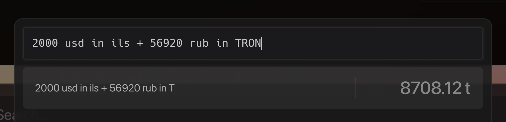

# elephant-numr

[numr](https://github.com/nasedkinpv/numr) calculator provider for [Walker/Elephant](https://github.com/abenz1267/walker) launcher.



## Prerequisites

- [Walker](https://github.com/abenz1267/walker) with Elephant backend
- [numr](https://github.com/nasedkinpv/numr) (`numr-cli` must be in PATH)

## Installation

### Arch Linux (AUR)

```bash
yay -S elephant-numr
```

### Manual

```bash
git clone https://github.com/nasedkinpv/elephant-numr
cd elephant-numr
sudo ./build.sh
```

The build script will:
1. Build the numr plugin for Elephant
2. Install to `/usr/lib/elephant/`
3. Configure Walker keybindings
4. Set up theme integration

## Setup

After installation, add `numr` to your Walker config:

**~/.config/walker/config.toml**
```toml
[providers]
default = [
  "desktopapplications",
  "numr",  # add this
]
```

Restart Walker:
```bash
systemctl --user restart elephant
```

## Keybindings

| Key | Action |
|-----|--------|
| `Enter` | Copy result to clipboard |
| `Ctrl+R` | Refresh exchange rates |
| `Shift+Enter` | Save expression to numr file |

Press `Alt+J` for actions menu.

## Configuration (optional)

**~/.config/elephant/numr.toml**
```toml
min_chars = 2        # minimum query length
require_number = true # require digit in query
command = "wl-copy -n %VALUE%"  # copy command
```
