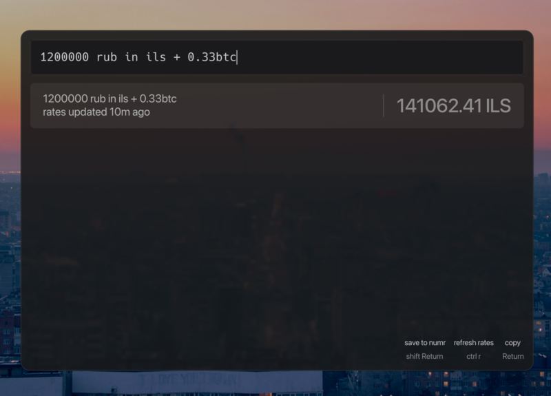

# elephant-numr

[numr](https://github.com/nasedkinpv/numr) calculator provider for the [Walker](https://github.com/abenz1267/walker) launcher with the Elephant backend.



## Requirements

- Walker with Elephant backend
- `numr-cli` in `PATH`
- Go, `curl`, and `tar` for manual builds

Elephant providers are Go plugins, so `numr.so` must be built against the same Elephant version as the running `elephant` binary. This repository pins that version in `build.sh` and `aur/PKGBUILD`.

## Installation

### Manual

```bash
git clone https://github.com/nasedkinpv/elephant-numr
cd elephant-numr
sudo ./build.sh
```

The script builds Elephant, the standard providers, and the Numr provider together, then installs them to `/usr/bin/elephant` and `/usr/lib/elephant/`.

## Setup

Add `numr` to your Walker providers:

```toml
[providers]
default = [
  "desktopapplications",
  "websearch",
  "numr",
]
```

Optional prefix:

```toml
[[providers.prefixes]]
prefix = "+"
provider = "numr"
```

Restart Elephant:

```bash
systemctl --user restart elephant
```

## Keybindings

| Key | Action |
|-----|--------|
| `Enter` | Copy result to clipboard |
| `Ctrl+R` | Refresh exchange rates |
| `Shift+Enter` | Save expression to numr file |

Press `Alt+J` for actions menu.

## Configuration (optional)

`~/.config/elephant/numr.toml`

```toml
min_chars = 2        # minimum query length
require_number = true # require digit in query
command = "wl-copy -n %VALUE%"  # copy command
```

## Updating

When Elephant updates, update the pinned version in `build.sh` and `aur/PKGBUILD`, rebuild, and restart Elephant. A stale plugin will fail to load.
